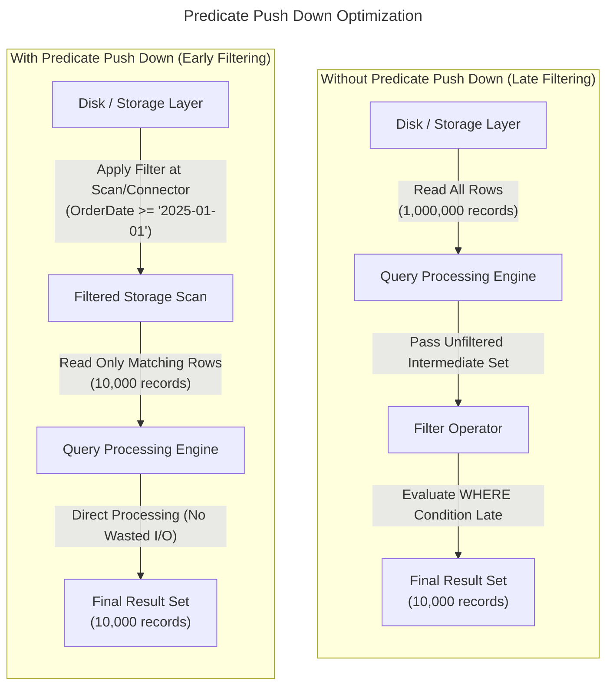
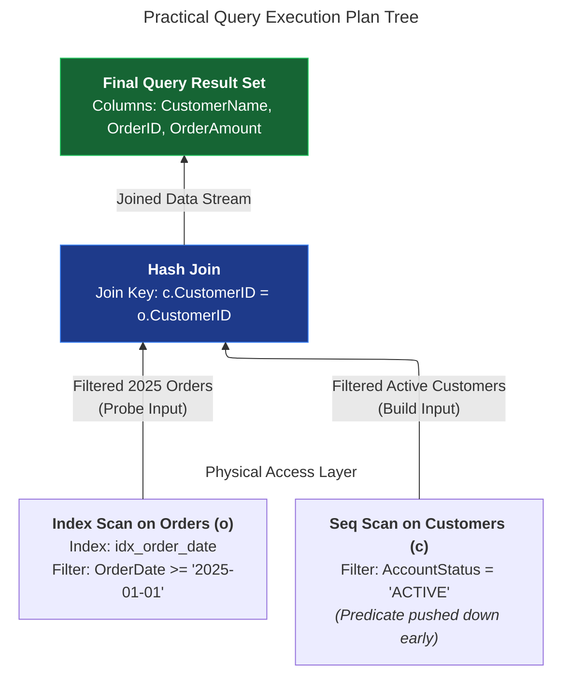

# Advanced query optimization

## Overview

Query optimization turns a declarative SQL statement into the most efficient
physical execution plan. The optimizer evaluates many possible access paths,
join strategies, and filter placements to reduce disk I/O, memory use, and
network traffic.

This guide introduces the main optimization patterns that affect query
performance in relational and distributed systems.

## Predicate push down

Predicate push down moves filtering conditions as early as possible in the
execution plan. The database applies the predicate close to the scan or storage
layer instead of waiting to read a larger intermediate result.



When the database applies the predicate early, it can discard rows before it
builds large intermediate result sets. This reduces memory pressure and avoids
wasted network and CPU work.

### Why it matters

Predicate push down works well when the engine can apply a condition near the
storage layer. Examples include filtering rows in a storage engine, a
connector, or a file scan step before the data reaches the query processing
layer.

This pattern often improves performance for queries such as:

- `WHERE order_date >= '2025-01-01'`
- `WHERE account_status = 'ACTIVE'`
- `WHERE region = 'North'`

### Benefits

- fewer rows move through the plan
- lower memory and CPU overhead
- less data transferred across engines or nodes
- better use of indexes and scan pruning

## Index scans versus sequential scans

When the engine reads a table, it chooses an access path. The two main options
are a sequential scan and an index scan.

### Sequential scan

A sequential scan reads rows in page order. It works well when the query needs
a large fraction of the table or when the table is small enough that a full
pass costs less than index access.

### Index scan and seek

An index scan or index seek uses a B-tree or a similar structure to find rows
that match a predicate. This approach reduces the amount of data the engine
reads when the predicate is selective.

| Dimension | Sequential scan | Index scan or seek |
| --- | --- | --- |
| Access pattern | contiguous I/O | tree traversal with targeted reads |
| Data selectivity | low selectivity with many matching rows | high selectivity with few matching rows |
| Lookup speed | linear scan | logarithmic search |
| Memory and cache use | can stream large amounts of data | usually lower memory use for narrow access |

### When to choose each approach

Choose a sequential scan when:

- the table is small
- the query needs a large fraction of the table
- the optimizer estimates that a full table read costs less than index access

Choose an index scan when:

- a predicate is highly selective
- the query filters on a narrow key range
- the engine can fetch only the required rows

## Join algorithms

When a query combines data from multiple tables, the optimizer chooses a join
strategy. The right choice depends on table size, sort order, memory, and the
predicate type.

| Join algorithm | Typical strength | Typical use case |
| --- | --- | --- |
| Nested loop join | good for small outer tables | selective access and index-assisted joins |
| Hash join | good for large unsorted inputs | large equality joins |
| Merge join | good for sorted inputs | ordered joins and pre-sorted streams |

### Nested loop join

A nested loop join iterates through rows from one input and probes the other
input for matching rows. This approach works well when the outer row set is
small and the inner side has an index.

### Hash join

A hash join builds an in-memory or on-disk hash table from one side of the join
and probes it with rows from the other side. This approach works well for large
joins where the predicate is equality-based and the inputs aren't already
sorted.

### Merge join

A merge join works well when both inputs sort on the join key. It streams
through both inputs and emits matches in order without building a large hash
structure.

### Join choice considerations

The optimizer compares estimated cost and chooses a join algorithm based on:

- row counts
- available memory
- sort order
- index availability
- join predicate type

## Complete example

Consider an e-commerce query that returns customer purchases for 2025.

```sql
SELECT
  c.CustomerName,
  o.OrderID,
  o.OrderAmount
FROM Customers c
JOIN Orders o
  ON c.CustomerID = o.CustomerID
WHERE o.OrderDate >= '2025-01-01'
  AND c.AccountStatus = 'ACTIVE';
```

The optimizer can choose a plan that applies filtering and join work in a
cost-aware order. A representative plan looks like this:



This example shows several optimization ideas:

- the optimizer can filter the `Customers` table before the join
- the `Orders` table can use an index on `OrderDate`
- the join can use a hash join instead of a nested loop join
- the optimizer can reduce rows before the join completes

### Step-by-step optimizer workflow

1. Parse the SQL syntax and bind names to real tables and columns.
2. Build a logical plan that represents the required join and filters.
3. Estimate row counts and selectivity for each predicate.
4. Choose access paths, such as a sequential scan, an index scan, or a seek.
5. Choose the join algorithm that minimizes overall cost.
6. Produce the physical plan and execute it.

This sequence is the core of advanced query optimization.

## Common pitfalls

### Predicate push down isn't always possible

The optimizer can't always move a predicate near the storage layer. It depends
on the database engine, connector capabilities, and how the optimizer rewrites
the expression. Complex expressions, function calls, and row-level processing can
limit early filtering opportunities.

### Access path estimation can be wrong

The optimizer chooses between a sequential scan and an index scan based on
estimates such as row counts, data distribution, and index selectivity. A table
scan can still be the cheapest option, and an index isn't always the right
choice. The cost model decides the final plan.

### Missing or stale statistics

The optimizer relies on statistics to estimate row counts and cost. If the
statistics are stale or absent, it can choose a poor plan even when the SQL is
correct.

### Overusing broad filters

Even a correct filter can be expensive if it runs late in the plan. Early
filtering reduces cost substantially.

### Choosing the wrong join strategy

A nested loop join can work well for a small lookup, but it can become slow for
large data sets. Hash joins and merge joins can outperform it for larger
inputs.

### Ignoring data distribution

The optimizer estimates cost based on data distribution, not only on the query
text. Data skew, duplicate keys, and unexpected cardinality can change the
execution plan.

## Key takeaways

- Query optimization turns declarative SQL into an efficient physical plan.
- Early filtering reduces the amount of data that the engine needs to process.
- The optimizer chooses between sequential scans and index scans based on
  selectivity and cost.
- Join algorithm choice depends on table size, sort order, memory, and predicate
  type.
- Execution plans and optimizer statistics are essential tools for diagnosing
  slow queries.

The exact behavior varies by database engine, but the optimization principles
remain consistent across systems.
