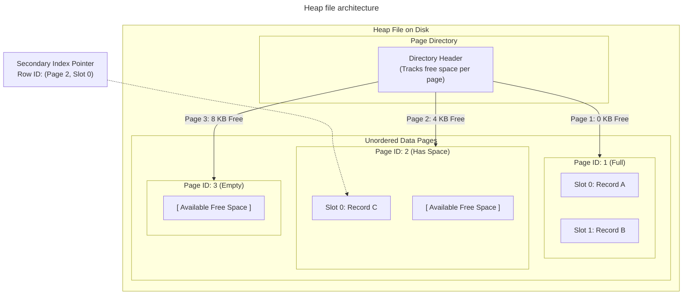
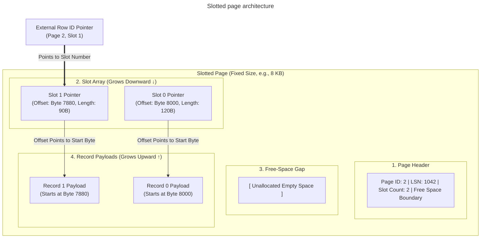
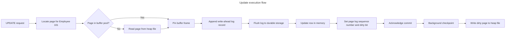

# Database storage engine internals

## Overview

A database storage engine manages how a relational database stores data on
disk, caches frequently used pages in memory, records changes, and recovers
after a failure.

This guide explains the main components of a page-oriented storage engine:

- Pages and heap files
- Slotted pages
- Buffer pools
- Write-ahead logging
- Checkpoints and crash recovery

The exact page size, cache policy, logging format, and recovery algorithm vary
by database engine. The concepts in this guide apply broadly, but you should
check your engine's documentation for implementation details.

## Storage engine architecture

The storage engine moves pages between durable storage and memory. It records
changes in the write-ahead log before it writes modified data pages back to the heap file.

```mermaid
---
title: Storage engine architecture
---
graph TD
    Client[Application / SQL Client]:::external

    subgraph RAM ["VOLATILE MEMORY (RAM)"]
        direction TB

        subgraph EngineMemory ["Database Process Space"]
            ExecutionEngine[Query execution engine]:::process

            subgraph BufferPool ["Buffer Pool Cache"]
                Page1["Page 1 (Clean)"]
                Page2["Page 2 (Dirty / Modified)"]
                Page3["Page 3 (Clean)"]
            end

            WALBuffer["WAL log buffer"]:::memory
        end
    end

    subgraph OS ["OPERATING SYSTEM / KERNEL"]
        OSIO["OS kernel and I/O subsystem"]:::process
    end

    subgraph Disk ["PERSISTENT STORAGE (DISK)"]
        direction TB

        subgraph HeapFiles ["Heap Data Files"]
            DiskPage1["Page 1 Block (8 KB)"]:::storage
            DiskPage2["Page 2 Block (8 KB)"]:::storage
            DiskPage3["Page 3 Block (8 KB)"]:::storage
        end

        WALFile["Write-ahead log file"]:::storage
    end

    %% Queries and Execution
    Client -->|1. SQL Query| ExecutionEngine

    %% Read Path
    ExecutionEngine -->|2. Check Cache| BufferPool
    BufferPool -.->|3a. Buffer Hit: Fast Read| ExecutionEngine
    BufferPool -->|3b. Buffer Miss: Request Page| OSIO
    OSIO -->|4. Read 8 KB Page| HeapFiles
    HeapFiles -.->|5. Load Page into RAM| BufferPool

    %% Write Path (Fast Path)
    ExecutionEngine -->|6. Modify Page in RAM| Page2
    ExecutionEngine -->|7. Append Log Record| WALBuffer
    WALBuffer -->|8. Flush Log Entry| OSIO
    OSIO -->|9. Sequential Append| WALFile
    WALFile -.->|10. Ack Durability| Client

    %% Background Flush Path (Slow Path)
    Page2 -.->|11. Async Checkpoint / Flush| OSIO
    OSIO -.->|12. Overwrite Page Block| DiskPage2

    class RAM memory;
    class Disk storage;
```



The diagram shows the logical relationships. A production engine can use
additional components, such as lock managers, transaction managers, indexes,
replication logs, and background writers.

## Pages and heap files

### Page-oriented storage

Database engines generally read and write fixed-size blocks called pages
rather than individual rows. Common page sizes include 4 KiB, 8 KiB, and
16 KiB, but the supported sizes depend on the database engine.

Each page has an address within a database file. Disk I/O operates on the
page, even when a query needs only one row from that page.

Page-oriented storage provides a consistent unit for:

- Reading and writing data.
- Tracking free space.
- Caching data in memory.
- Recording page-level changes.

### Heap files

A heap file is an unordered collection of data pages. The storage engine
places a new row on a page with enough free space instead of maintaining a
sorted order.



The engine maintains a free-space map or page directory to find pages that
can hold new rows.

A row in a heap file has a physical identifier, often called a row ID.
It commonly contains a page identifier and a slot number:

```text
(Page ID, Slot number)
```

Secondary indexes can store this identifier as a pointer to the row's
location in the heap.

## Slotted pages

Fixed-size pages must store variable-length rows such as `VARCHAR`, `TEXT`,
and columns that can be null. A slotted page uses an array of row pointers so that
the row data can move within the page without changing the row's logical slot.



A slotted page contains:

1. **Page header:** metadata such as the page identifier, log sequence number,
   slot count, and free-space boundaries.
2. **Slot array:** pointers that store each record's offset and length.
3. **Free-space gap:** space between the slot array and record payloads.
4. **Record payloads:** the variable-length row data.

When the engine compacts a page or moves a variable-length row, it updates the
slot's offset. The slot number can remain stable, so indexes that reference
the row identifier continue to locate the row.

## Buffer pools

A buffer pool, also called a buffer cache, stores copies of database pages in
RAM. Reading a page from memory is generally faster than reading it from
storage, so the buffer pool reduces repeated storage access for frequently
used pages.

The buffer pool contains:

- **Frames:** fixed-size memory regions that hold database pages.
- **Page table:** an in-memory mapping from a page ID to a frame.
- **Dirty bit:** indicates that the memory copy differs from the durable copy.
- **Pin count:** prevents the engine from evicting a page while a query uses it.
- **Eviction policy:** selects an unpinned page when the pool needs space.

Common eviction strategies include least recently used and Clock
variants. The selected policy and its tuning options depend on the database
engine.

### Buffer-pool lifecycle

When a query requests a page, the buffer manager:

1. Checks the page table.
2. Returns the page from an existing frame if it's present.
3. Reads the page from the heap file when the lookup misses.
4. Selects an unpinned victim frame if the buffer pool is full.
5. Writes a dirty victim page to durable storage only when the write-ahead log rule allows
   it.

## Write-ahead logging

Write-ahead logging records changes in an append-only log before the engine
writes the modified data page to the heap file.

### Write-ahead logging rule

The storage engine follows this ordering:

1. Create a log record for the change.
2. Flush the required write-ahead log records to durable storage.
3. Modify the page in the buffer pool.
4. Flush the dirty page later, after the log record is durable.

This ordering lets the engine acknowledge a committed transaction after the
log is durable, without forcing every changed data page to receive a random
storage write at commit time.

### Log sequence numbers

Each write-ahead log record commonly has a log sequence number. The page header
can store the log sequence number of the newest log record applied to that page. During
recovery, the engine compares page log sequence numbers with log sequence
numbers in the write-ahead log to determine which changes it must
replay.

The exact write-ahead log format and durability properties depend on the database engine
and its configuration.

## Crash recovery

If the process or host fails, the failure can discard changes that existed only in RAM.
The engine uses the write-ahead log and checkpoint metadata to restore a consistent state.

Many engines describe recovery as two broad activities:

- **Redo:** reapply logged changes that the data pages might not contain.
- **Undo:** remove changes from transactions that had not committed.

The recovery algorithm, terminology, and ordering can vary. Some engines also
use full-page images, checksums, double-write buffers, or other mechanisms to
protect against partial page writes.

## Update execution

Consider this statement:

```sql
UPDATE Employees
SET Salary = 95000
WHERE EmployeeID = 101;
```

The storage path is conceptually:



The steps are:

1. The query executor asks the buffer manager for the page containing
   `EmployeeID = 101`.
2. On a buffer miss, the buffer manager reads the page from the heap file into
   an available frame.
3. The engine appends a write-ahead log record describing the update.
4. The engine flushes the required log data to durable storage.
5. The engine updates the row in the memory page, records the page log sequence number, and
   marks the frame dirty.
6. The transaction can acknowledge a durable commit according to the engine's
   configured durability settings.
7. A background writer or checkpoint process later writes the dirty page to
   the heap file.

## Common pitfalls

### Buffer-pool thrashing

Buffer-pool thrashing occurs when the active working set is much larger than
the available buffer pool. The engine repeatedly evicts and reloads pages,
which increases storage I/O and query latency.

Monitor cache hit rates, storage latency, query plans, and working-set size.
Reduce unnecessary scans and size the buffer pool according to the workload
and available memory.

### Write amplification and page splits

A small row update can eventually require the engine to write the entire page.
An update that expands a variable-length row can also leave insufficient free
space on the page.

Depending on the storage engine, the row might move, the page might split, or
the engine might create an overflow or forwarding reference. These operations
can increase storage writes and later read work.

### Checkpoint frequency and recovery time

Frequent checkpoints can add background write activity. Infrequent checkpoints
can leave more work in the write-ahead log, which can lengthen redo after a failure.

Choose checkpoint settings by measuring normal write load, recovery targets,
storage throughput, and available write-ahead log capacity.

### Torn pages

A torn page is a page that reaches storage only partially before a power loss
or hardware failure. The durable copy can contain portions from different
versions of the page.

Engines can protect against torn pages with mechanisms such as double-write
buffers, page checksums, or full-page images in the write-ahead log. Verify which
mechanisms your database engine and storage configuration provide.

## Key takeaways

- Database engines read and write pages rather than individual rows.
- Heap files store unordered pages, while slotted pages track movable row
  payloads with stable slots.
- Buffer pools cache pages and use dirty bits, pin counts, and eviction
  policies to manage memory.
- Write-ahead logging records changes before the engine flushes modified data pages.
- Crash recovery uses logged changes to redo durable work and undo incomplete
  transactions.
- Checkpoint and cache settings affect both normal performance and recovery
  time.
