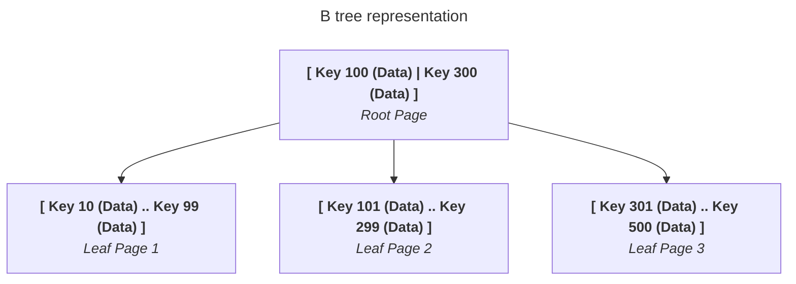
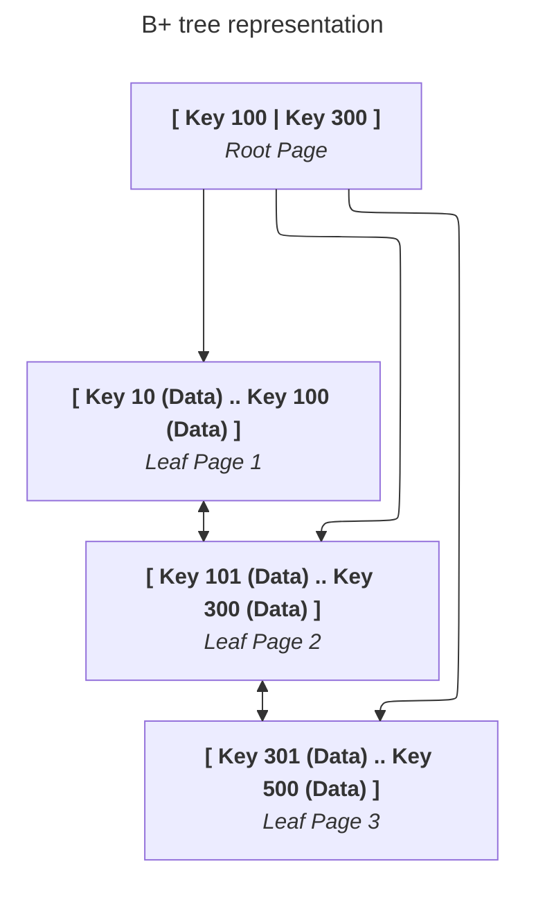
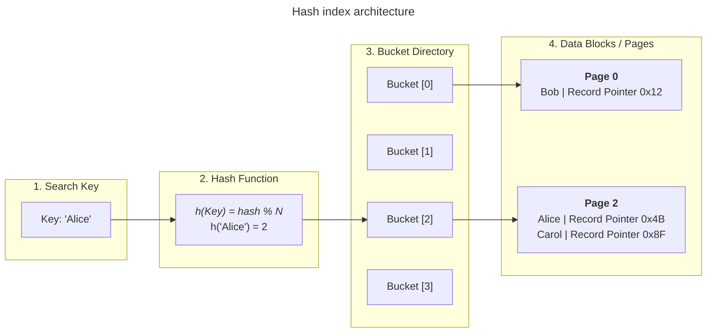
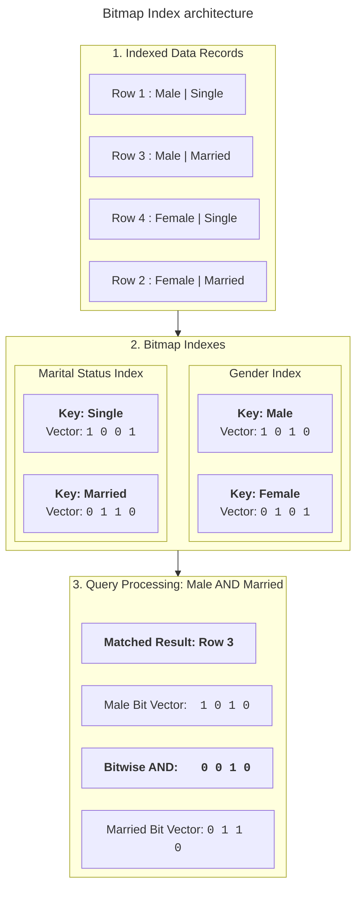

# Database indexing internals

## Overview

An index is an auxiliary data structure that helps a database find rows
without scanning every row in a table. An index stores key values and
references to the corresponding table data.

Indexes can improve point searches, joins, sorting, and range queries. They also
require storage and maintenance when the database inserts, updates, or
deletes rows. The appropriate index depends on the database engine, workload, data
distribution, and query predicates.

## B-tree indexes

A B-tree is a balanced, multi-way search tree that stores keys in sorted order.
Database engines organize the tree into pages so that one page read can
process several keys. The tree remains balanced as rows change.

An abstract B-tree looks like this:



The database follows key ranges from the root toward a leaf page. Balanced
depth keeps point searches and range scans efficient as the index grows.

B-trees support common predicates such as:

- Equality, such as `CustomerID = 105`.
- Ranges, such as `SignupDate >= '2026-01-01'`.
- Prefix searches, such as `Email LIKE 'alice%'`, when the collation and index
  support the pattern.
- Ordered scans and joins on indexed columns.

Page size, tree layout, and the exact implementation depend on the database
engine.

## B+ tree indexes

A B+ tree is a related tree structure that stores search keys in internal pages
and stores row references or data in leaf pages. Leaf pages are commonly linked
in key order, which supports sequential range scans.



Many relational database engines use a B+ tree or a similar balanced-tree
structure for general-purpose indexes. The exact default differs by engine,
storage engine, and index type. Check the engine documentation before relying
on a particular implementation.

## Hash indexes

A hash index maps a key to a bucket using a hash function:



Hash indexes primarily support equality predicates, such as
`Email = 'alice@example.com'`. They generally don't support ordered range
scans in the same way as a B-tree.

Hash-index support, durability, collision handling, and optimizer behavior
vary by database engine. Use a hash index only when its equality-lookup
benefit matches the workload and the engine supports it effectively.

## Bitmap indexes

A bitmap index represents each distinct value with a bit vector. Each bit
corresponds to a row:



Bitmap indexes work well for columns with few distinct values and workloads
that read many rows, such as analytical queries. Bit operations can
combine conditions efficiently.

Frequent writes can make bitmap indexes expensive to maintain or lock,
depending on the database engine. They're often less suitable for highly
concurrent transactional workloads.

## Clustered and secondary indexes

### Clustered indexes

A clustered index determines how a table stores its rows or how the table data
relates to the index's leaf pages. Because the table data follows the
clustered order, a range scan can read nearby rows efficiently.

A table can usually have only one clustered organization because its rows can
follow only one physical or logical order. Some engines don't support
clustered indexes, and others implement them through the primary key or a
clustered-table structure.

Choose a clustered key that supports common range access and remains stable.
Frequent changes to a wide or randomly distributed clustered key can increase
page splits and maintenance work.

### Non-clustered or secondary indexes

A non-clustered index stores indexed keys separately from the table data. Its
leaf entries contain a row identifier, a primary-key value, or another
reference that lets the database find the base row.

Secondary indexes can support additional filters, joins, and sort orders.
When a query uses a secondary index, the database might need extra row fetches to
retrieve columns that the index doesn't contain.

The exact terms and storage behavior vary by database engine. In this guide,
**secondary index** refers to an index separate from the table's primary
storage organization.

### Covering indexes

A covering index contains every column that a query needs. The database can
answer the query from the index without fetching the base table row:

```sql
CREATE INDEX idx_customers_region_signup
  ON Customers (Region)
  INCLUDE (SignupDate);
```

The `INCLUDE` syntax is engine-specific. An equivalent index might place all
required columns in its key, although that can increase the size and
maintenance cost of the key.

Covering indexes can reduce base-row fetches, but they use additional storage
and increase write work. Create them for measured, important query patterns
rather than for every possible column combination.

## Compare index types

| Index type        | Main layout                                          | Equality lookup                   | Range access                     | Typical use                                 |
| ----------------- | ---------------------------------------------------- | --------------------------------- | -------------------------------- | ------------------------------------------- |
| B-tree or B+ tree | Balanced sorted tree.                                | Supported.                        | Supported.                       | General transactional queries.              |
| Hash              | Hash buckets.                                        | Supported.                        | Not the primary use.             | Exact equality searches.                    |
| Bitmap            | Bit vectors for distinct values.                     | Supported through bit operations. | Engine-dependent.                | Low-cardinality analytical queries.         |
| Clustered         | Table rows follow the index order.                   | Supported.                        | Often efficient for nearby rows. | Primary storage order and range access.     |
| Secondary         | Keys and row references separate from table storage. | Supported.                        | Depends on key order.            | Additional filters, joins, and sort orders. |
| Covering          | Secondary index contains requested payload columns.  | Supported.                        | Depends on key order.            | Avoiding base-row fetches.                  |

This table describes common properties. Always verify the implementation and
optimizer behavior for your database engine.

## Complete example

The following schema illustrates a primary key, a unique secondary index, and
a covering index. The database engine determines whether the primary key uses
clustered storage, so the example doesn't assume that behavior:

```sql
CREATE TABLE Customers (
  CustomerID INTEGER PRIMARY KEY,
  Email VARCHAR(255) NOT NULL,
  Region VARCHAR(50) NOT NULL,
  SignupDate DATE NOT NULL
);

CREATE UNIQUE INDEX idx_customers_email
  ON Customers (Email);

CREATE INDEX idx_customers_region_signup
  ON Customers (Region)
  INCLUDE (SignupDate);
```

### Point lookup by primary key

```sql
SELECT
  CustomerID,
  Email,
  Region,
  SignupDate
FROM Customers
WHERE CustomerID = 105;
```

The optimizer can use the primary-key index to find the row. The exact access
method depends on the engine and query plan.

### Point lookup by email

```sql
SELECT
  CustomerID,
  Email,
  Region,
  SignupDate
FROM Customers
WHERE Email = 'alice@example.com';
```

The unique email index can locate at most one matching row. The database might
use the index to find the row and then fetch columns from the base table.

### Covered lookup by region

```sql
SELECT SignupDate
FROM Customers
WHERE Region = 'West';
```

The region index includes both the filter key and `SignupDate`, so the engine
may answer this query without fetching the base table rows.

Use `EXPLAIN`, `EXPLAIN ANALYZE`, or the engine's equivalent plan tool to
verify which index the database chooses.

## Index maintenance and performance

An index improves some reads but adds work to writes. For an insert, update, or
delete, the database might need to update every affected index, split pages,
and maintain index metadata.

Consider these tradeoffs:

- **Read performance:** indexes can reduce the number of rows or pages that a
  query reads.
- **Write performance:** more indexes usually mean more write work.
- **Storage:** indexes consume disk or memory.
- **Statistics:** the optimizer uses statistics to estimate selectivity and
  choose a plan.
- **Selectivity:** an index is more useful when a predicate excludes a large
  portion of the table, although the optimizer can use low-selectivity
  indexes in some plans.
- **Column order:** for a composite index, the leading key columns affect
  which predicates and sort orders the index can support.

Don't rely on a fixed selectivity threshold such as 15% or 20%. The useful
threshold depends on table size, data distribution, caching, storage costs,
and the query plan.

## Common pitfalls

### Too many indexes

Every additional index can increase insert, update, and delete costs. It can
also consume storage and create overlapping indexes that provide little
benefit.

Review index usage and query plans regularly. Remove redundant indexes only
after confirming that no important query depends on them.

### Poor clustered-key choice

A clustered key that changes frequently or inserts random values can cause
page splits and fragmented storage. A wide key also increases the size of
secondary indexes on engines that store the clustered key in secondary
entries.

Choose a stable, appropriately sized key, and validate the write pattern with
the database engine's monitoring tools.

### Low-selectivity predicates

An index on a column with few distinct values might not reduce the work enough
to justify random row fetches. The optimizer might choose a table scan instead.

Don't assume that an index is useful for every predicate. Compare the plan
with representative data.

### Bitmap indexes in write-heavy workloads

Bitmap indexes can be effective for analytical reads, but concurrent writes
can require more maintenance or locking. Confirm the engine's bitmap-index
behavior before using one on a frequently updated table.

### Covering indexes with excessive payload columns

Adding many included columns can make a covering index large and expensive to
maintain. Include only the columns that remove a measured, important base-row
lookup.

### Assuming the engine uses an index

The optimizer can choose a different access path because of statistics,
selectivity, data volume, or query shape. The engine might choose another access path instead of the declared index.

Use an execution plan and current statistics to verify the access path.

## Key takeaways

- Use balanced-tree indexes for general equality and range access.
- Use hash indexes primarily for equality searches when the engine supports
  them effectively.
- Use bitmap indexes for suitable low-cardinality analytical workloads.
- Choose clustered keys carefully because they affect table organization and
  secondary indexes.
- Use covering indexes selectively to avoid base-row fetches.
- Balance read improvements against write, storage, and maintenance costs.
- Verify index choices with execution plans and representative data.
