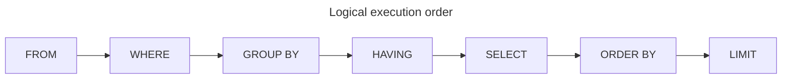
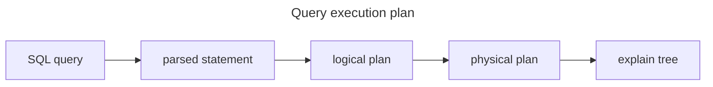
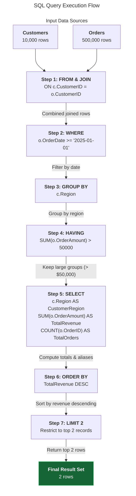
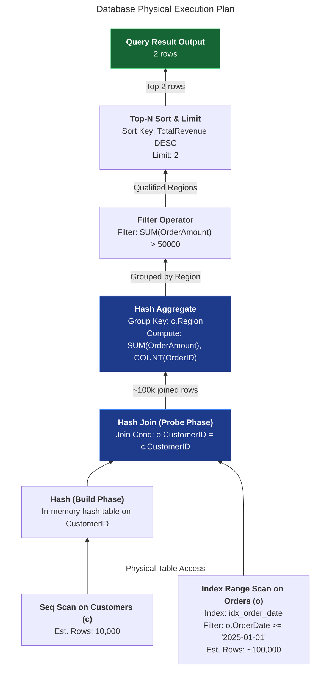

# Query execution engine

## Overview

SQL is a declarative language. You describe the data you want, and the query
optimizer decides how to retrieve and process it efficiently.

This guide explains two ideas that matter when you write and troubleshoot SQL:

- the logical order in which the database evaluates a query
- the `EXPLAIN` plan that shows the physical work chosen by the optimizer

The written SQL order and the actual execution order are different. That's why
it's important to understand both semantic behavior and performance behavior.

## Logical execution order

You usually write SQL in this order:

```sql
SELECT
FROM
WHERE
GROUP BY
HAVING
ORDER BY
LIMIT
```

The database engine usually evaluates a query in this order instead:



This order describes the logical execution pipeline. It's the model that
explains how the engine filters rows, groups them, computes expressions, sorts
the results, and limits the output.

### Reading source rows

The engine starts with the tables listed in the `FROM` clause. If the query has
join conditions, it combines rows from those tables before any other work.

This step creates the input row set for the rest of the query.

### Filtering rows

The `WHERE` clause filters individual rows before aggregation. Only rows that
match the predicate continue to the next stage.

This early filter is important for performance because it reduces the number of
rows that later steps must process.

### Grouping data

The `GROUP BY` clause partitions rows into buckets based on one or more column
values. Rows with the same group key go to the same bucket.

After grouping, aggregate functions such as `SUM`, `COUNT`, and `AVG` operate on
those groups.

### Filtering grouped data

The `HAVING` clause filters grouped results after aggregation. It's the right
place for conditions such as `SUM(amount) > 50000`.

This is different from `WHERE`, which runs before the grouping step.

### Selecting output columns

The `SELECT` clause shapes the final output. It chooses which columns to return,
computes expressions, and assigns aliases.

The engine evaluates this stage after it finishes row filtering and grouping.

### Sorting and limiting

The `ORDER BY` clause sorts the final rows. The `LIMIT` or `OFFSET` clause then
restricts the number of rows returned.

This is why the final output order doesn't always match the order of the source
rows.

## Explain plans and the optimizer

The logical execution order explains SQL semantics. The optimizer explains how the
engine executes the query in practice.

A database optimizer converts a declarative SQL statement into a physical
execution plan. It decides which access path to use, which joins to perform,
and which operators to run first.



An `EXPLAIN` plan shows the sequence of physical operations, access methods, join
algorithms, and estimated costs chosen by the optimizer.

### What an explain plan includes

An explain plan can show:

- table scans or index scans
- filter operators
- join operators such as nested loops, hash joins, or merge joins
- grouping and aggregation
- sorting
- limit and offset

These details help answer questions such as:

- Did the optimizer use an index?
- Did the engine filter rows early?
- Did it sort a large intermediate result?
- Was the join order effective?

## Complete example

Consider a database with two tables: `Customers` and `Orders`. The goal is to
return the top two regions with total sales greater than $50,000 for orders
placed in 2025.

```sql
SELECT
  c.Region AS CustomerRegion,
  SUM(o.OrderAmount) AS TotalRevenue,
  COUNT(o.OrderID) AS TotalOrders
FROM Customers c
JOIN Orders o
  ON c.CustomerID = o.CustomerID
WHERE o.OrderDate >= '2025-01-01'
GROUP BY c.Region
HAVING SUM(o.OrderAmount) > 50000
ORDER BY TotalRevenue DESC
LIMIT 2;
```

### Example flow



This flow matches the logical execution model. The database doesn't read the
query in the grammatical order you wrote it. The engine follows the evaluation
pipeline described earlier.

### Example explain plan

The following output is representative of a PostgreSQL-style explain plan:



This plan shows that the optimizer chose:

- a hash join for the join step
- a scan on `Customers`
- an index scan on `Orders` with a pushed date filter
- a hash aggregation for the `GROUP BY`
- a sort before the final limit

The optimizer estimates costs and chooses work that reduces processing.

## Common pitfalls

### Using aliases in the where clause

A column alias created in `SELECT` isn't available in the `WHERE` clause. The
`WHERE` clause runs before the database resolves the final `SELECT` output.

If you need to filter on an alias, use a nested query or move the predicate into
`HAVING` when it applies to grouped rows.

### Putting aggregate filters in the where clause

A `WHERE` clause can't filter on aggregate results such as `SUM(amount) >
50000`. Those conditions belong in `HAVING`, which runs after aggregation.

### Optimizer reordering versus logical order

The logical order shows the semantics of SQL. The optimizer can reorder
operations to improve performance while preserving the same result.

This means a query plan can look different from the SQL order without being
wrong.

### Explain versus explain analyze

`EXPLAIN` shows the estimated execution plan. `EXPLAIN ANALYZE` runs the query
and reports actual runtime metrics.

Use `EXPLAIN` to inspect the plan shape and `EXPLAIN ANALYZE` to validate real
performance and row counts.

## Key takeaways

- SQL is declarative, but the database still follows a defined evaluation
  pipeline.
- The logical order is usually `FROM` to `LIMIT`.
- The optimizer chooses a physical plan that can reorder work for efficiency.
- `EXPLAIN` plans help you understand and tune query behavior.
- A strong understanding of both semantics and execution strategy helps you write
  better SQL and debug slow queries.

Use `EXPLAIN`, `EXPLAIN ANALYZE`, and your database's execution plan reference
materials to validate query behavior in production.
